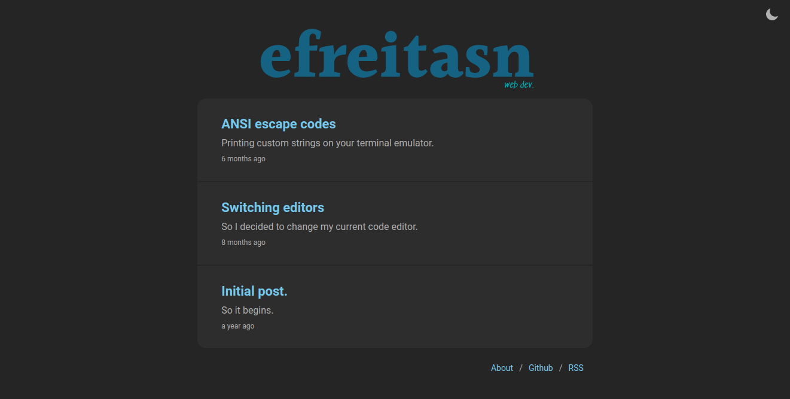
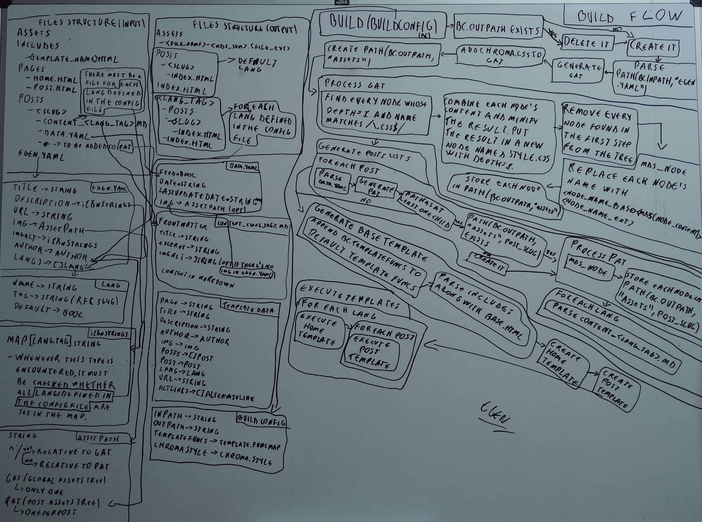
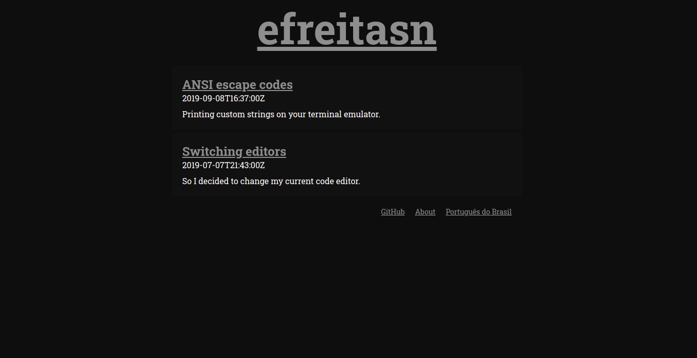

A few weeks ago I was analyzing this blog. While doing so, I couldn't help but think that it could be way simpler. Also, the design wasn't something I was liking that much anymore. It needed a revamp.

## Original version
I created this blog one year ago and used Gatsby and TypeScript as the stack. I'm a huge fan of React and GraphQL, so Gatsby seemed like the right choice at the time. After creating some layout for the blog, defining some colors etc the blog was finally live.



I have to say, using Gatsby was really cool. Again, I'm a huge fan of GraphQL. I had already used it with React and I just can't stress enough how much I liked it. Combining the idea of UI isolation with the one of asking only for the data that you need just makes sense. Then, taking this to libraries such as Apollo or Relay just makes your application's data fetching process better.

Surely, the focus of this post is not GraphQL and React, but I had to say how much I like when the two are used together. Seriously, if you haven't tried Gatsby or even GraphQL+React with Apollo or Relay, I really encourage you to do so.

## The problem
After some months, especially near the the end of last year, I started realizing that my blog didn't need to have so much. I came to the conclusion that using Gatsby was just adding an overhead that wasn't justifiable. Let's not forget that I'm not talking about a considerably large project. I'm talking about a blog that, at the end of the day, doesn't really need JavaScript at all because of how simple it's supposed to be.

In that spirit, I wanted to remove all JavaScript/Typescript code from the repository, stop using Gatsby and go with something that would be easier to maintain and customize down the road. I gotta say, I tend to prefer building my own things instead of using something that already exists. Because of that, I took advantage of this revamp and decided to build my own static blog generator in Go. That's where egen starts. 

## egen
Before I could start building this generator, I had to think about how it'd actually work. Files/directories structure, templates, assets names for caching, image resizing for responsive images, internationalization etc. My first commit was on January 13th, and the process of building this simple static blog generator took more than I thought. Since then, a lot of things changed until I got to the current v1.0.0. Certainly, I don't remember everything, so I'll talk about how some of the things are as of now.

I drew a diagram of the build flow a few days ago. It's missing some things, particularly the part about responsive images, but you can get the gist of it.



To explain some things, I'll use as reference [this blog's repository](https://github.com/efreitasn/efreitasn.dev), which has the following structure:

```text
content
  assets
  includes
  pages
  posts
  egen.yaml
main.go
```

and the `main.go` file is:

```go
package main

import (
	"fmt"
	"html/template"
	"os"

	"github.com/alecthomas/chroma"
	"github.com/alecthomas/chroma/styles"
	"github.com/efreitasn/egen"
)

func main() {
	chromaStyleB := styles.Get("swapoff").Builder()
	chromaStyleB.Add(chroma.Background, "bg:#0e0e0e")
	chromaStyleB.Add(chroma.LineHighlight, "bg:#171717")

	chromaStyle, err := chromaStyleB.Build()
	if err != nil {
		fmt.Fprintln(os.Stderr, err)
	}

	err = egen.Build(egen.BuildConfig{
		InPath:      "./content",
		OutPath:     "./dist",
		ChromaStyle: chromaStyle,
		TemplateFuncs: template.FuncMap{},
	})
	if err != nil {
		fmt.Fprintln(os.Stderr, err)
	}
}
```

The `content` directory is the directory passed as input to egen, the `inPath`. The `main.go` file is where the build process starts. Yes, egen is not a CLI. It's simply a package that you import into your Go project. I made it that way so that the user could personalize some Go-related things, namely template functions. Making it that way allows the user to provide custom functions to be used in a template.

### Templates
Speaking of which, templates use, as you may have guessed, Go's template syntax. There are three templates that are mandatory and are located at `<inPath>/pages/home.html`, `<inPath>/pages/post.html` and `<inPath>/pages/404.html`. The first is the template used to generate the `index.html` file and is executed once per language specified in the config file (`egen.yaml`). The second is the one used to generate an HTML page for each post in each of the specified languages. The last is for the not found page. I'll talk more about the languages in the config file in the internationalization section.

Templates with arbitrary names can also be created. They're located at the `<inPath>/includes` directory and are used the same way as any other template in Go. You may think that, because of how Go templates are defined, the file needs to start with `{{ define "<template_name>" }}` and end with `{{ end }}`, but these two lines are actually added automatically by egen. The `<template_name>` part is taken from the file's name.

### Posts
Posts are located at `<inPath>/posts`. Each post is a directory whose name is the post's slug. Inside the post's directory, there's a file named `data.yaml`, which contains info about the post, including whether it's an invisible post. There's also one file per language named `content_<lang_tag>.md` with a YAML frontmatter.

#### Invisible posts
An invisible post is a just like a normal post, it becomes an HTML file, its assets are processed etc. However, it's not present in the posts list passed to the templates. This kind of post serves the purpose of a page in a blog.

This idea of invisible posts came when the Gatsby version was still around. It's something simple, but it's what allowed me to use the same layout for posts and pages. Apart from the home page and the 404 page, everything is a post. For example, [this blog's about page](https://efreitasn.dev/posts/about) is an invisible post.

### Assets
Assets are files that have a special processing depending on the type of file. To understand how this works, I need to talk about the assets tree.

#### Assets tree
The assets tree is a tree generated based on a directory. Given a directory, the assets tree is created by recursively examining the directory's children. When generating this tree, a list of regular expressions can be passed to be matched against a child's name. If it matches, the child and its children, if any, are not added to the tree. To make things easier, if the name passed to a regular expression is of a directory, it ends with a `/`.

The resulting tree basically resembles the input directory's structure, except when it comes to JPEG and PNG images. Whenever an image in one of these formats is encountered while generating the tree, it doesn't become a file node, but an image node. An image node is very much like a file node, but it also has a `sizes` field that defines how many versions of the image will be created while processing the tree. More about the `sizes` field in the responsive images section.

Assets trees are divided into two kinds: GAT and PAT. GAT (global assets tree) is generated once per build and it's based on the `<inPath>/assets` directory. PAT (post assets tree) is generated once per post and it's based on the `<inPath>/posts/<post_slug>` directory, excluding files whose name matches `/(^content_.+\.md$)|(^data\.yaml$)|(^.*/$)/`. Note that the assets in a PAT can only be accessed from its post's `content_<lang_tag>.md` files, the post's template and any other templates inside of it. There's not PAT when executing the home template, for example.

Because of these two kinds of assets trees, there need to be some kind of tree identifier when referring to an asset. For example, given a path to an asset in a post's `content_<lang_tag>.md` file, how will it be decided if this path was referring to an asset in the GAT or in the post's PAT? The path could be searched in both of them, and one of them would take precedence over the other, but I opted for something more declarative. If the path starts with a `/`, it's relative to the GAT, otherwise it's relative to the current PAT, if there's one. And that's actually the description of the `AssetRelPath` type.

##### Processing
The processing starts with the CSS files part, which is a part exclusive to the GAT's processing. It consists of combining every CSS file node with depth=1 into one single node named `style.css` Then, the content of this node is minified and the other nodes are removed from the tree. After this part, GAT and PAT trees are processed in the same way.

The rest of the processing is basically traversing the tree, generating the `processedPath` for each node and storing the node's content in this path. The `processedPath` is the place where the file will be stored or the directory will be created. It always starts with `<outPath>/assets` and the number of directories after that depends on the node's depth. The end of the path, the node's new name, is based on the node's type. If it's a directory, the name remains the same. If it's a file, the name becomes `<filename_base>-<md5sum(file_content)>.<filename_ext>`. If it's an image, a directory named `<md5sum(file_content)>` is created, and a version of the image for each of the widths specified in the `sizes` field is created and placed inside the directory. The `md5sum` parts were added to make assets ready for caching.

### Responsive images
Another thing that I really like about Gatsby is the [gatsby-remark-images plugin](https://www.gatsbyjs.org/packages/gatsby-remark-images). The part about it taking images in markdown, generating smaller versions of them and automatically setting the value of the `srcset` and `sizes` attributes is really helpful. So, I had to do something similar with egen.

On egen, a list of widths and a string to be used as the `sizes` attribute's value are specified in the config file. With this info, when an image is encountered while processing a markdown file, egen does the following (note that, at this point, both the GAT and the current PAT have already been processed):

* The image's path's respective node in the GAT or in the current PAT is found.
* Widths specified in the config file that are smaller than or equal to the image's width are added to the node's sizes list, if not already in it.
* The widths in the node's `sizes` field that haven't already been processed are processed (remember: it's in the processing part that the variant-width images are effectively created).
* All of the processed widths are used to generate the value of the `srcset` attribute.
* Finally, the `srcset` and `sizes` attributes are set in the new `` tag.

What if there's a need to use responsive images outside of a post? To cover this case, a function named `srcSetValue(AssetRelPath)` and the field `ResponsiveImgMediaQueries` are exposed to the templates. I actually use something similar to this approach to make a post's main image responsive in this blog, since this image is not a part of the markdown content.

```html
{{ if .Post.Img }}
  
{{ end }}
```

The value of the `sizes` attribute is hardcoded because the images in the post's content have a different width than the post's main image.

### Internationalization
As I mentioned before, egen accepts a list of languages in the config file (`egen.yaml`). Among the items in the list, one of them must be marked as the default language. This is all part of my goal to make this blog's posts easier to be translated from a structural point of view.

A post has `content_<lang_tag>.md` files inside its directory that specify the post's translated versions. These files also have an YAML frontmatter, which specifies language-dependent info about the post, such as its title and excerpt.

The internationalization of content goes beyond the posts, actually. It's created one version of the blog for each language. The default language version is the one at `/`, while the others are located at `/<lang_tag>`.

## About JavaScript
So, I was able to create the blog with almost no JavaScript. By almost I mean: there's still some JavaScript because of analytics, and that's okay. The problem was never JavaScript itself, but the way it was used in here. To be honest, there's one thing that I miss about using JavaScript, and that is being able to get the user's timezone and format the posts' dates accordingly. My workaround, at least for now, was to show dates in the ISO 8601 format.

## Conclusion


I think that's it for now. I set out to build a simpler blog and that's what I believe I did. I'm really happy with both egen and the blog's new layout/design. I tried to explain some of the stuff I did on egen and I hope you were able to understand it. Here's a link for the [egen repository](https://github.com/efreitasn/egen) in case you want to fork it, file an issue or just read more about it.