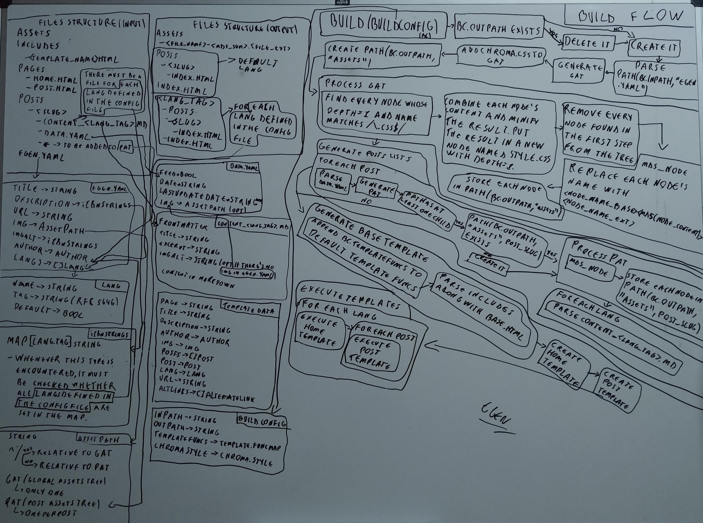

Há algumas semanas eu estava analisando esse blog. Enquanto fazia isso, eu acabei percebendo que ele poderia ser muito mais simples. Fora que o design também era algo que eu já não estava mais gostando tanto. O blog precisava ser renovado.

## Versão original
Eu criei esse blog há um ano e usei Gatsby e TypeScript como stack. Eu sou um grande fã de React e GraphQL, então Gatsby parecia a escolha ideal na época. Após criar um layout, definir as cores etc o blog estava pronto.


Eu tenho que dizer, minha experiência com Gatsby foi muito boa. Como eu disse, eu sou um grade fã de GraphQL. Eu já havia usado-o com React e gostei muito dessa integração. Combinar a ideia de isolação de UI com a de pedir ao servidor apenas os dados que você precisa simplesmente faz sentido. Se você utiliza bibliotecas como Apollo e Relay, então o processo de obtenção de dados da sua aplicação melhora consideravelmente.

Claro, o foco desse post não é GraphQL e React, mas eu tinha que falar um pouco sobre como eu gosto de quando os dois são usados juntos. Sério, se você ainda não criou algo usando Gatsby ou até mesmo React+GraphQL, eu encorajo-o a fazer isso.

## O problema
Após alguns meses, especialmente próximo ao fim do ano passado, eu comecei a perceber que o meu blog não precisava ter tantas coisas. Eu cheguei à conclusão que usar Gatsby estava adicionando uma sobrecarga que não era justificável. Não vamos esquecer que eu não estou falando sobre um projeto consideravelmente grande. Eu estou falando sobre um blog que, no fim das contas, nem mesmo precisa de JavaScript devido ao quão simples ele deve ser.

Seguindo esse pensamento, eu decidi remover todos arquivos JavaScript/TypeScript do repositório, parar de usar Gatsby e começar a usar algo que seria mais fácil de manter e customizar posteriormente. Eu devo admitir, eu prefiro construir minhas próprias coisas ao invés de usar algo que já existe. Por causa disso, eu aproveitei essa renovação e decidi construir meu próprio gerador de blogs estáticos em Go. E é assim que o egen começa.

## egen
Antes que eu pudesse começar a trabalhar nesse gerador de blogs, eu tinha que pensar como ele de fato funcionaria. Estrutura de arquivos/diretórios, templates, nomes de assets para caching, redimensionamento de images para ter imagens responsivas, internacionalização etc. Meu primeiro commmit foi em 13 de janeiro, e eu acabei trabalhando nesse projeto mais tempo do que eu imaginei. Desde então, inúmeras coisas mudaram até que eu conseguisse chegar na versão v1.0.0 atual. Certamente, eu não consigo lembrar de tudo, então eu irei falar um pouco sobre como o projeto está agora.

Eu desenhei um diagrama do fluxo de build há alguns dias. Algumas coisas não estão presentes nele, particularmente a parte sobre imagens responsivas, mas com ele há como ter uma visão geral desse fluxo.



A fim de explicar algumas coisas, eu usarei o [repositório desse blog](https://github.com/efreitasn/efreitasn.dev) como exemplo, cuja estrutura é a seguinte:

```text
content
  assets
  includes
  pages
  posts
  egen.yaml
main.go
```

e o arquivo `main.go` é:

```go
package main

import (
	"fmt"
	"html/template"
	"os"

	"github.com/alecthomas/chroma"
	"github.com/alecthomas/chroma/styles"
	"github.com/efreitasn/egen"
)

func main() {
	chromaStyleB := styles.Get("swapoff").Builder()
	chromaStyleB.Add(chroma.Background, "bg:#0e0e0e")
	chromaStyleB.Add(chroma.LineHighlight, "bg:#171717")

	chromaStyle, err := chromaStyleB.Build()
	if err != nil {
		fmt.Fprintln(os.Stderr, err)
	}

	err = egen.Build(egen.BuildConfig{
		InPath:      "./content",
		OutPath:     "./dist",
		ChromaStyle: chromaStyle,
		TemplateFuncs: template.FuncMap{},
	})
	if err != nil {
		fmt.Fprintln(os.Stderr, err)
	}
}
```

O diretório `content` é o `inPath`, o diretório passado como input para o egen. O arquivo `main.go` é onde o processo de build começa. Sim, egen não é uma CLI. É simplesmente um package que você importa no seu projeto Go. Eu fiz desse jeito para que o usuário pudesse personalizar algumas coisas em Go, principalmente as funções passadas aos templates. O fato que egen não é uma CLI permite ao usuário fornecer funções personalizadas para serem usadas nos templates.

### Templates
Falando neles, templates usam, como você já deve ter imaginado, a sintaxe de templates de Go. Há dois templates que são obrigatórios e estão localizados em `<inPath>/pages/home.html`, `<inPath>/pages/post.html` e `<inPath>/pages/404.html`. O primeiro é o template usado para gerar o arquivo `index.html` e é executado uma vez por linguagem especificada no arquivo de configuração (`egen.yaml`). O outro é usado para gerar uma página HTML para cada post em cada uma das linguagens especificadas. Eu falarei mais sobre as linguagens presentes no arquivo de configuração na seção sobre internacionalização.

Templates com nomes arbitrários também podem ser criados. Eles ficam localizados no diretório `<inPath>/includes` e são usados da mesma maneira que qualquer outro template em Go. Talvez você pense que o arquivo precisa começar com `{{ define "<template_name>" }}` e terminar com `{{ end }}`, mas essas duas linhas são adicionadas automaticamente. A parte do `<template_name>` é obtida a partir do nome do arquivo.

### Posts
Os posts estão localizados em `<inPath>/posts`. Cada post é um diretório cujo nome é o slug do post. Slug é, basicamente, um identificador para um post. Dentro desse diretório, há um arquivo chamado `data.yaml`, que contém informações sobre o post, incluindo se ele é ou não invisível. Há também um arquivo por linguagem chamado `content_<lang_tag>.md`, que contém um frontmatter em YAML.

### Post invisíveis
Um post invisível é como um post qualquer, ele se tranforma em um arquivo HTML, seus assets são processados etc. Entretanto, ele não está presente na lista de posts passada aos templates. Esse tipo de post serve o propósito de uma página em um blog.

Esse ideia de post invisível surgiu durante a versão Gatsby. É algo simples, porém é o que me permitiu usar o mesmo layout para posts e páginas. Com exceção da página inicial e da página 404, tudo é um post. Por exemplo, [a página sobre desse blog](https://efreitasn.dev/posts/about) é um post invisível.

### Assets
Assets são arquivos que têm um processamento especial dependendo do tipo de arquivo. Para entender como isso funciona, eu preciso falar sobre a árvore de assets.

#### Árvore de assets
A árvore de assets é uma árvore gerada baseando-se em um diretório. Dado um diretório, a árvore de assets é criada examinando, recursivamente, o conteúdo desse diretório. Ao gerar essa árvore, uma lista de expressões regulares pode ser passada para ser testada com o nome de cada arquivo e diretório descendente do diretório base. Se há uma correspondência, o arquivo é ignorado ou, caso seja um diretório, o diretório e seus descendentes são ignorados. Para facilitar as coisas, se o nome a ser testado com as expressões regulares é de um diretório, ele termina com o caractere `/`. 

A árvore resultante lembra bastante a estrutura do diretório base, exceto com relação a imagens JPEG e PNG. Quando uma imagem em um desses formatos é encontrada ao gerar a árvore, essa imagem não se torna um nó do tipo arquivo, mas sim um nó do tipo imagem. Um nó do tipo imagem é como um nó do tipo arquivo, porém ele também tem a propriedade `sizes` que define quantas versões da imagem serão criadas ao processar a árvore. Irei falar mais sobre a propriedade `sizes` na seção sobre imagens responsivas.

Árvores de assets são divididas em dois tipos: GAT e PAT. GAT (global assets tree) é gerada uma ver por build e é baseada no diretório `<inPath>/assets`. PAT (post assets tree) é gerada uma vez por post e é baseada no diretório `<inPath>/posts/<post_slug>`, excluindo arquivos cujo nome corresponda à `/(^content_.+\.md$)|(^data\.yaml$)|(^.*/$)/`. Note que os assets em uma PAT só podem ser acessados a partir dos arquivos `content_<lang_tag>.md` do post relacionado à PAT, pelo template do post e por quaisquer outros templates nele. Não há uma PAT ao executar o template da página inicial, por exemplo.

Devido a haver dois tipos de árvores de assets, é necessário ter algum tipo de identificador de árvore ao fazer uma referência a um asset. Por exemplo, dado um caminho para um asset em um arquivo `content_<lang_tag>.md` de um post, como será decidido se esse caminho está se referindo à PAT do post ou à GAT? O caminho poderia ser buscado em ambas, e uma teria precedência sobre a outra, porém eu optei por algo mais declarativo. Se o caminho começa com `/`, é relativo à GAT, do contrário é relativo à PAT atual, se houver alguma. E essa é, na verdade, a descrição do tipo `AssetRelPath`.

##### Processamento
O processamento de uma árvore de assets começa com a parte dos arquivos CSS, que é uma parte exclusiva ao processamento da GAT. Nela, todos nós referentes a arquivos CSS e que possuem profundidade=1 (depth) são combinados, resultando em um único nó chamado `style.css`. Após isso, o conteúdo desse novo nó é minificado e os outros nós são removidos da árvore. Após essa parte, árvores GAT e PAT são processadas da mesma maneira.

O restante do processamento é basicamente realizar um traverse na árvore, gerando o `processedPath` para cada nó e armazenando o conteúdo do nó nesse caminho. O `processedPath` é o local em que o arquivo será armazenado ou o diretório será criado. Ele sempre começa com `<outPath>/assets` e o número de diretórios depois disso depende da profundidade do nó. O fim desse caminho, o novo nome do nó, é baseado no tipo do nó. Se é um diretório, o nome continua o mesmo. Se é um arquivo, o nome fica `<nome_do_arquivo_base>-<md5sum(conteúdo_do_arquivo)>.<nome_do_arquivo_extensão>`. Se é uma imagem, um diretório chamado `<md5sum(conteúdo_do_arquivo)>` é criado, e uma versão da imagem para cada width especificado na propriedade `sizes` é criada e armazenada dentro do diretório. As partes `md5sum` foram adicionadas para tornas os assets prontos para caching.

### Imagens responsivas
Outra coisa que eu gosto bastante sobre o Gatsby é o [plugin gatsby-remark-images](https://www.gatsbyjs.org/packages/gatsby-remark-images). A parte sobre ele pegar as imagens em markdown, gerar versões menores delas e automaticamente definir o valor dos atributos `srcset` e `sizes` é muito útil. Então, eu tinha que fazer algo similar a isso com o egen.

No egen, uma lista de widths e uma string para ser usada como o valor do atributo `sizes` são especificadas no arquivo de configuração. Com essas informações, ao encontrar uma imagem ao processar um arquivo markdown, o egen faz o seguinte (note que, nesse ponto, tanto a GAT quanto a PAT atual já foram processadas):

* O nó relativo ao caminho da imagem é encontrado, seja na GAT ou na PAT atual.
* Widths especificados no arquivo de configuração que são menores ou igual ao width da imagem são adicionados ao atributo `sizes` do nó, se já não estiverem nele.
* Os widths na propriedade `sizes` do nó que ainda não foram processados são processados (lembre-se: é no processamento que as imagens com widths variantes são, de fato, criadas).
* Todos os widths processados são usados para gerar o valor do atributo `srcset`.
* Finalmente, os atributos `srcset` e `sizes` têm seus valores definidos na nova tag ``.

E se houver a necessidade de usar imagens responsivas fora de um post? Para cobrir esse caso, uma função chamada `srcSetValue(AssetRelPath)` e a proprieade `ResponsiveImgMediaQueries` são expostas aos templates. Eu uso algo similar a essa abordagem para tornar a imagem principal de um post responsiva nesse blog, já que essa imagem não é parte do conteúdo em markdown.

```html
{{ if .Post.Img }}
  
{{ end }}
```

O valor do atributo `sizes` foi hardcoded porque as imagens no conteúdo do post têm um width diferente do width da imagem principal do post.

### Internacionalização
Como eu mencionei anteriormente, o egen aceita uma lista de linguagens no arquivo de configuração. Dentre os itens dessa lista, um deles tem que ser marcado como a linguagem padrão. Isso tudo é parte do meu objetivo de tornar os posts desse blog mais fáceis de serem traduzidos de um ponto de vista estrutural.

Um post tem arquivos `content_<lang_tag>.md` dentro de seu diretório que especificam as versões traduzidas do post. Esses arquivos também têm um frontmatter em YAML, que especifica informações do post que são dependentes da linguagem, como o título e a descrição.

A internacionalização de conteúdo vai além dos posts, na verdade. É criada uma versão do blog para cada linguagem. A versão da linguagem padrão fica em `/`, e as outras versões ficam em `/<lang_tag>`.

## Sobre JavaScript
Então, eu consegui criar o blog com quase nenhum JavaScript. Com quase eu quero dizer: ainda há um pouco de JavaScript devido ao analytics, mas está tudo bem. O problema nunca foi o próprio JavaScript, mas a maneira como ele era usado aqui. Para ser honesto, há uma coisa que eu sinto falta com relação ao JavaScript, e é ser capaz de obter a timezone do usuário e formatar as datas dos posts adequadamente. Por ora, as datas estão sendo exibidas no formato ISO 8601.

## Conclusão


Eu acho que é isso por enquanto. Eu tinha o objetivo de construir um blog mais simples e acredito que tenha alcançado-o. Estou muito feliz com o egen e o novo layout/design do blog. Eu tentei explicar algumas coisas que eu fiz no egen e espero que você tenha conseguido entendê-las. Aqui tem o link para o [repositório do egen](https://github.com/efreitasn/egen) caso você queira relizar um fork, criar uma issue ou somente ler mais sobre ele.