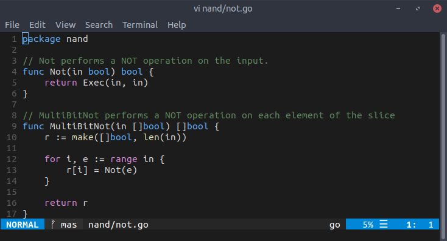
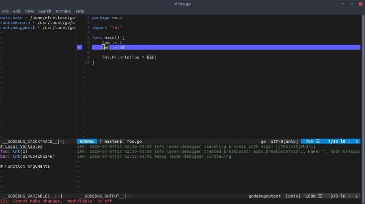
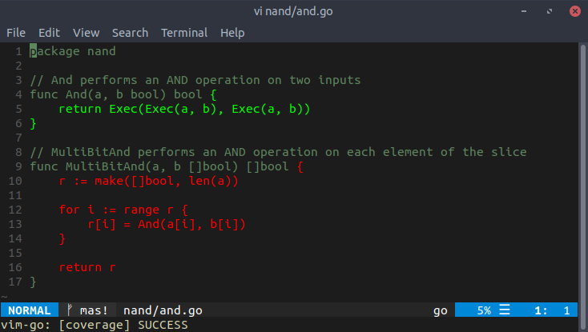

Então eu mudei de editor. Fazia um ano que eu usava o VSCode e não tinha o que reclamar sobre ele. Basicamente, é um ótimo editor. Apesar de que eu estava feliz com o VSCode, eu queria tentar essa ideia de um editor no terminal. No fim, eu acabei gostando bastante dessa ideia.

## Contexto
Essa não é a minha primeira vez usando vim. Eu já havia usado-o há alguns anos quando eu estava aprendendo sobre bash, como usar o terminal etc. Isso aconteceu quando eu estava migrando do Windows para uma distro Linux. Apesar do porquê dessa mudança não ser o foco do post, eu acho que é válido dizer que uma das razões foi o terminal presente em distros. Nessa época, eu já havia usado algumas distros ocasionalmente e o terminal era algo que eu realmente gostava.

Sim, Windows tem cmd e PowerShell, mas não é a mesma coisa. O terminal é algo muito importante quando se trata de Linux, porém a situação não é assim quando se trata de Windows. Não estou dizendo que o terminal não é usado no Windows, porém quando você compara papel dele no Windows e o papel dele em uma distro Linux, você sabe do que eu estou falando. Claro, o porquê de eu preferir um terminal ao invés de outro vai além do papel que cada um exerce em seu respectivo SO, mas é baseado nisso. Por exemplo, compare o processo de instalar algo no Windows e esse processo em uma distro. Enquanto que no último isso é, na maioria das vezes, 4 palavras no terminal, no primeiro não é bem assim.

Após eu começar a usar uma distro como meu principal SO e fazer coisas através do terminal, eu me tornei mais produtivo. Sério, é incrível o quão mais produtivo você pode se tornar usando o terminal. Claro, foi assim comigo. Não significa que funciona assim com todos :)

Enfim, voltando para o vim.

## O que eu gosto sobre o vim
Para mim, vim realmente se destaca devido a ele ser baseado em comandos. Não há ícones ou context menu. É tudo baseado em comandos. Melhor ainda, você pode digitar um comando simplesmente pressionando `:`, que é quando o foco vai para a parte inferior do editor, seguido do comando. Já que é baseado em comandos, seus plugins acabam se tornando bastante intuitivos. Não há novos elementos adicionados à interface, somente novos comandos.

A maneira como navega em um arquivo no vim é algo que, em um primeiro momento, pode parecer um pouco estranho. Você navega no arquivo atual usando teclas como `w` (avança uma palavra), `h` (volta um caractere) etc. Caso queira, por exemplo, avançar duas palavras, apenas digite `2w`. Sim, é muito intuitivo. Uma vez que você se acostuma com isso, esse tipo de padrão se torna muito útil.

## Tema
Enquanto eu procurava por temas para o vim, eu encontrei [vim-code-dark](https://vimawesome.com/plugin/vim-code-dark), que é um tema baseado no tema Dark+ do VSCode. Ele parece bastante familiar para mim quando aplicado ao editor, já que Dark+ é o meu tema no VSCode.

## Plugins
Essa é a minha parte favorita. Eu uso alguns plugins, que podem ser vistos [aqui](https://github.com/efreitasn/config/blob/master/.vimrc), mas eu gostaria de falar sobre dois deles: [fugitive-vim](https://vimawesome.com/plugin/fugitive-vim) e [vim-go](https://vimawesome.com/plugin/vim-go).

### fugitive-vim
Hoje em dia, todo editor de código tem algum tipo de integração com o Git. Pessoalmente, eu sempre prefiro usar o comando `git` no terminal. Para falar a verdade, eu nunca usei a ferramente do Git no VSCode para algo além de resolver conflitos ou ver a diferença entre versões de um arquivo. Entretanto, no vim, essa integração é muito útil para mim. Uma vez que o vim é baseado em comandos, esse plugin me permite digitar os próprios comandos do Git sem ter que sair do editor. Na verdade, esse plugin oferece mais do que isso, como você pode ver no link acima, mas há apenas mais uma coisa que eu gostaria de falar sobre, que é o comando `Gstatus`.

#### Adicionar à área de staging
Se você digitar o comando `Gstatus`, uma nova janela aparece na aba atual. Nessa janela, você vê todas as mudanças que estão e não estão na área de staging. Nela, você pode ir com o cursor sobre cada mudança e digitar `-` para adicionar/remover ou `=` para ver a diferença entre a versão do arquivo nessa mudança e a sua versão na staging ou HEAD. Basicamente, você pode ver todos os arquivos modificados e adicionar/remover da staging facilmente com o teclado.

### vim-go
No VSCode, ao instalar a extensão de Go, você ganha algumas coisas como um debugger integrado, `goimports` e `go vet` sendo executados sempre que um arquivo é salvo, definições etc. Eu queria algo semelhante a isso com vim, então eu acabei encontrando esse plugin. Eu tive que mexer em algumas coisas, a fim de fazer com que os comandos supracitados fossem executados sempre que um arquivo fosse salvo, como você pode ver no meu [.vimrc](https://vimawesome.com/plugin/vim-go), mas não foi nada de mais.

Esse plugin possui vários comandos legais. Tem até um comando para mostrar as free variables de uma seleção (`GoFreevars`), mas eu irei falar somente sobre as partes de debugging e test coverage.

#### Debugging
Quando se trata de debugging, você adiciona um breakpoint executando o comando `GoDebugBreakpoint` e começa a debugar com `GoDebugStart`. Após isso, é step-in, step-out, step-over e next.

A experiência de debugging é muito legal. Essa era uma das coisas que eu mais queria ver como funcionava no vim. Por exemplo, como o processo de verificar o valor de uma expressão no ponto atual do debugging seria.

#### Testing coverage
Esse plugin fornece uma maneira bastante intuitiva de ver quanto de um arquivo está coberto por testes. Ao executar `GoCoverageToggle`, você pode habilitar/desabilitar anotações no arquivo atual que destacam quais partes estão cobertas por testes.

## Conclusão
O objetivo desse post não era convencer alguém a usar vim, muito menos fornecer uma explicação detalhada de alguns dos seus plugins. O objetivo era compartilhar algumas coisas que eu aprendi desde que eu comecei a usar esse editor na última semana. Eu farei um novo post ou atualizarei esse quando encontrar um novo comando legal.