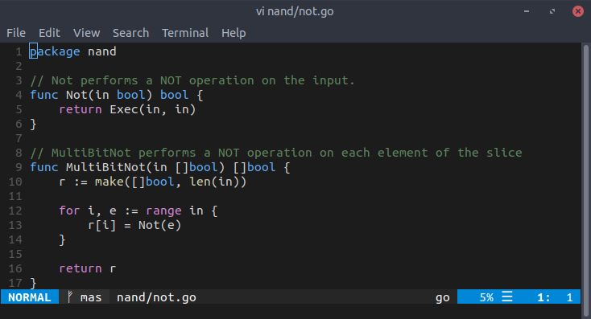
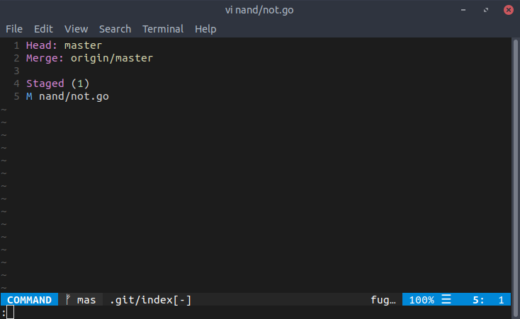
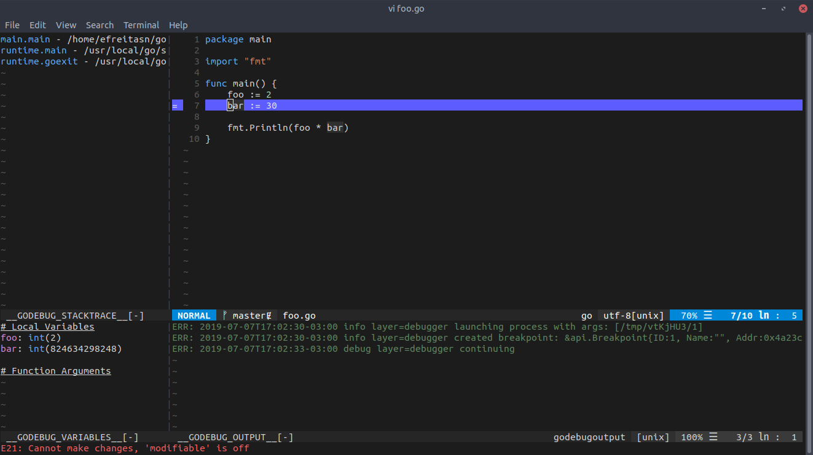
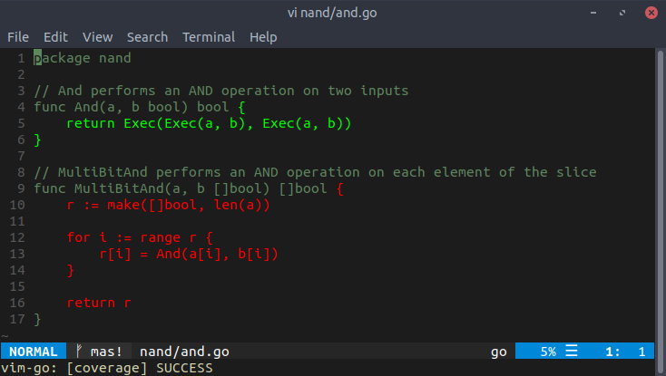

So I switched my code editor. I've been using VSCode for a year now and have nothing to complain about it. Basically, it's a very good editor. Even though I was happy with VSCode, I wanted to try this idea of an editor in the terminal. As it turns out, I ended up really liking this idea.

## Background
This is not my first time using vim. I had already used it a few years ago when I was learning about bash, how to use the terminal etc. This happened while I was switching from Windows to a Linux distro. Even though the why of this change is not the subject of the post, I think it's valid to say that one of the reasons was the terminal present in Linux distros. At this point, I had already used some distros occasionally and the terminal was something that I really enjoyed.

Yes, Windows has cmd and PowerShell, but it's not the same thing. The terminal is a very important thing in the Linux world, but not so much in the Windows space. It's not that the terminal isn't used in Windows, but when you compare the role it plays on Windows and the role it plays on a Linux distro, well, you know what I'm saying. Surely, why I prefer one terminal over the other goes way more than the role it plays on its respective OS, but it's mostly based on that. For one, take installing apps on Windows and on a Linux distro. While in the latter this is, most likely, 4 words away in the terminal, in the former it takes a little more than that.

After I started using a distro as my main OS and doing more things through the terminal, I became more productive. Seriously, it's amazing how much productivity you can gain using the terminal. For instance, it's way faster navigating between directories using it than using a GUI, at least to me.

Anyways, now onto vim.

## What I like about it
To me, vim really shines because of the fact that it's based on commands. There are no icons or context menu. It's all commands. Even better, you can enter a command just by typing `:`, which is when the focus goes to the bottom part of the editor, followed by the command. The fact that it's all based on commands makes its plugins very intuitive, since there are no UI elements added, there are just new commands.

The way navigating in a file works in vim is something that, at first, may seem a little weird. You navigate in the current file using keys like `w` (word by word forward), `h` (a character to the left) etc. In case you want, for example, go two words forward, you just type `2w`. Yeah, it's that intuitive. Once you get used to it, this sort of pattern can really come in handy.

## Theme
While looking for color schemes for vim, I found [vim-code-dark](https://vimawesome.com/plugin/vim-code-dark), which is a color scheme based on the Dark+ theme for VSCode. It looks pretty good and very familiar to me, since my VSCode theme is Dark+.

## Plugins
This is my favorite part. I use some plugins, which can be found [here](https://github.com/efreitasn/config/blob/master/.vimrc), but I'd like to talk about two of them: [fugitive-vim](https://vimawesome.com/plugin/fugitive-vim) and [vim-go](https://vimawesome.com/plugin/vim-go).

### fugitive-vim
These days, every code editor has some kind of Git integration. Personally, I always prefer using the `git` command in the terminal. To be honest, I never used the Git tool in VSCode for more than resolving conflicts or seeing the diff between the version of a file in the working tree and its version in the HEAD. However, in vim this integration is very useful to me. Being based on commands, I can even type the actual git commands without leaving the editor. Actually, this plugin offers more than that, as you can see in the link above, but there's only one more thing about it that I'd like to talk about, which is the `Gstatus` command.

#### Adding to stage
If you enter the `Gstatus` command, a new window appears in the current tab. In this window, you see all staged and unstaged changes. Then, you can go with the cursor over each change and press `-` to stage/unstage it or `=` to see the diff between the working tree and staged versions. Basically, you can see all the changed files, their diff and stage/unstage them very easily with the keyboard. I cannot stress enough how useful this is. 

### vim-go
In VSCode, once you install the Go extension, you get some nice things, such as a debugger integrated in the editor, `goimports` and `go vet`  being run on every file save, definitions etc. I wanted something similar with vim, so I took a look at this plugin. I had to set a couple of things to make the aforementioned commands being run in every file save, as you can see in my [.vimrc](https://vimawesome.com/plugin/vim-go), but it was no big deal.

This plugin has a lot of nice commands. Seriously. There's even a command to show the free variables of a selection (`GoFreevars`). but I'll just talk about the debugging and testing coverage parts.
#### Debugging
When it comes to debugging, you add a breakpoint by entering the `GoDebugBreakpoint` command and start debugging with `GoDebugStart`. Then, it's the whole step-in, step-out, step-over and next thing.

The debugging experience is very cool. Actually, this was one of the things that I was most looking forward to see in vim. For instance, how something like evaluating an expression in the current point of the file would be.

#### Testing coverage
This plugin provides a very intuitive way to see how much of a file is covered by tests. By entering `GoCoverageToggle`, you can toggle annotations in your file that highlight which parts are covered by tests.

## Conclusion
This post wasn't about convincing someone to use vim, nor a detailed explanation of some of its plugins. This was a way of sharing a few things that I learned since I started using it in the past week. I'll make a new post or update this one when I find a new cool command. 
